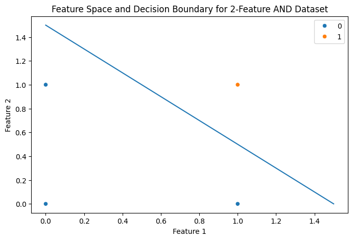
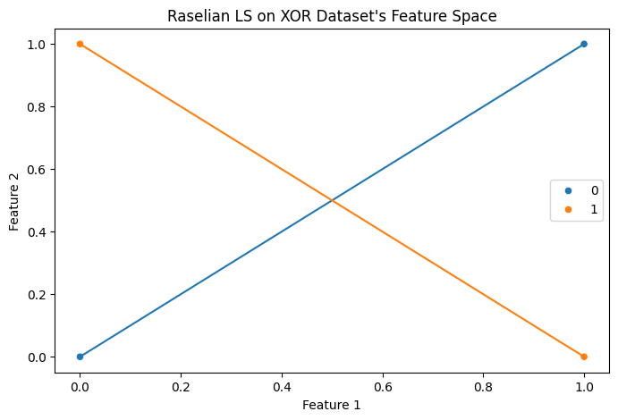

# Module 02 | How Perceptrons Learn – Intuition, Code, and Edge Cases

## My Solution to [Practice Problems](module02%20Practice%20Problems.pdf)

### Table of Contents {ignore=true}

<!-- @import "[TOC]" {cmd="toc" depthFrom=3 depthTo=3 orderedList=true} -->

<!-- code_chunk_output -->

1. [In one sentence, what problem does a perceptron solve?](#in-one-sentence-what-problem-does-a-perceptron-solve)
2. [What are the three main components of a perceptron?](#what-are-the-three-main-components-of-a-perceptron)
3. [Is perceptron a classifier or a regressor? Explain briefly.](#is-perceptron-a-classifier-or-a-regressor-explain-briefly)
4. [Why do we need to update weights in a perceptron?](#why-do-we-need-to-update-weights-in-a-perceptron)
5. [What happens if we never update the weights during training?](#what-happens-if-we-never-update-the-weights-during-training)
6. [Which two quantities decide how much the weight changes?](#which-two-quantities-decide-how-much-the-weight-changes)
7. [What does the term $`(y − \hat{y})`$ represent in perceptron learning?](#what-does-the-term-y--haty-represent-in-perceptron-learning)
8. [If the prediction is correct, will weights change? Why?](#if-the-prediction-is-correct-will-weights-change-why)
9. [What role does the learning rate (η) play intuitively?](#what-role-does-the-learning-rate-η-play-intuitively)
10. [Write the AND gate truth table.](#write-the-and-gate-truth-table)
11. [Why is AND gate linearly separable?](#why-is-and-gate-linearly-separable)
12. [Draw a rough decision boundary that separates AND gate outputs.](#draw-a-rough-decision-boundary-that-separates-and-gate-outputs)
13. [Why do we add a bias term in the perceptron?](#why-do-we-add-a-bias-term-in-the-perceptron)
14. [Why is bias often added after summation?](#why-is-bias-often-added-after-summation)
15. [Why do we initialize weights with small random values?](#why-do-we-initialize-weights-with-small-random-values)
16. [What is the purpose of `np.dot(X, w)` in perceptron code?](#what-is-the-purpose-of-npdotx-w-in-perceptron-code)
17. [Why is matrix transpose used in weight updating?](#why-is-matrix-transpose-used-in-weight-updating)
18. [What will happen if we remove the activation function?](#what-will-happen-if-we-remove-the-activation-function)
19. [Why can OR gate be solved using a single perceptron?](#why-can-or-gate-be-solved-using-a-single-perceptron)
20. [What is common between AND and OR gates from a geometry view?](#what-is-common-between-and-and-or-gates-from-a-geometry-view)
21. [Does XOR need more features or more layers? Why?](#does-xor-need-more-features-or-more-layers-why)
22. [What does linearly separable mean?](#what-does-linearly-separable-mean)
23. [Why can’t a single straight line separate XOR data?](#why-cant-a-single-straight-line-separate-xor-data)
24. [What change is required to solve XOR successfully?](#what-change-is-required-to-solve-xor-successfully)
25. [List two strengths of a perceptron.](#list-two-strengths-of-a-perceptron)
26. [List two limitations of a perceptron.](#list-two-limitations-of-a-perceptron)
27. [When should we avoid using a single-layer perceptron?](#when-should-we-avoid-using-a-single-layer-perceptron)
28. [Given $`x_1 = 1`$, $`x_2 = 1`$, Weights $`= [1, 1]`$ and Bias $`= -1.5`$, will the perceptron output be $`1`$ or $`0`$? (Show reasoning in one line)](#given-x_1--1-x_2--1-weights--1-1-and-bias---15-will-the-perceptron-output-be-1-or-0-show-reasoning-in-one-line)

<!-- /code_chunk_output -->

### In one sentence, what problem does a perceptron solve?

`Perceptron` is the first successful learning algorithm that enables an `Artificial Neuron` (AN) to learn from data, thus enabling the AN (also called `Perceptron`, after the algorithm used to train it) to solve `Binary Classification Problem` for a `Linearly Separable Dataset`, while even more simplicity was allowed in its conception.

### What are the three main components of a perceptron?

From `a perceptron`, I infer `an AN trained using the Perceptron Algorithm`.

Its main components are:

1. `Weights and Bias` (to combine inputs linearly)
2. `Step Function` (as Activation Function)
3. `Input and Output` (as I cannot find a third, which is solely a component of the perceptron)

### Is perceptron a classifier or a regressor? Explain briefly.

A Perceptron's activation function is the step function, which has the set $`\{ 0, 1\}`$ as its range, which is numerical, but discrete. So, `a Perceptron is a Classifier`.

### Why do we need to update weights in a perceptron?

`In Machine Learning, the whole point is that a model should learn its parameters from data`. So, during training (that is, learning), a perceptron should update its parameters, including `Weights`, when the data says, the current values of its parameters could be and should be improved to fit the data.

### What happens if we never update the weights during training?

Then, it's neither 'Learning', nor 'Training', nor 'Machine Learning', let alone 'Deep Learning'. Because, `In Machine Learning, the whole point is that a model should learn its parameters from data`.

Such a model, stuck with random initial guesses for parameters (`Weights and Bias`), is sure to underfit the dataset.

### Which two quantities decide how much the weight changes?

1. `The Learning Rate`, denoted by the Greek Letter $`\eta`$ (eta).
2. `The Product of 'Prediction Error' and 'Feature Value'`, in the current training example.

### What does the term $`(y − \hat{y})`$ represent in perceptron learning?

`The Prediction Error` in the current training example. $`y`$ is the true label and $`\hat{y}`$ is the prediction.

### If the prediction is correct, will weights change? Why?

`The Perception Update Rule` for `Weights` is:

```math
w_{i, \text{new}} \leftarrow w_{i, \text{old}} + \eta  (y − \hat{y}) x_i
```

The change is: $`\Delta w = w_{i, \text{new}} - w_{i, \text{old}} = \eta  (y − \hat{y}) x_i`$.

If prediction is correct, for the current training example, a factor in $`\Delta w`$ is $`0`$, namely, $`y- \hat{y} = 0`$, making $`\Delta w = 0`$. Hence, `NO CHANGE`.

### What role does the learning rate (η) play intuitively?

```math
\Delta w = \eta  (y − \hat{y}) x_i
```

$`(y-\hat{y})x_i`$ provides $`\Delta w`$ with correct direction toward optimality, which is nice. But its absolute value, from the general 'Gradient standpoint', is in a inverse relation with the distance to the optimal point.

Without $`\eta`$, the risk is either overshooting or too slow convergence. The hyperparamer $`\eta`$ is about balancing this tradeoff, by modifying the step size suggested by $`(y-\hat{y})x_i`$.

### Write the AND gate truth table.

| A | B | AND(A,B) |
| :---: | :---: | :---: |
| 0 | 0 | 0 |
| 0 | 1 | 0 |
| 1 | 0 | 0 |
| 1 | 1 | 1 |


### Why is AND gate linearly separable?

`The 2-Feature AND Dataset`, which is a Binary Classification Dataset, resembling the truth table for 2-Input AND Logic Gate, is called `Linearly Separable`, because it's `Feature Space` can be perfectly divided among its classes with a single hyperplance (which is a line in 2D and a plane in 3D). This answers why it is **called** `Linearly Separable`.

But why is it ~~called~~ `Linearly Separable`? I won't attemp to construct a proof here. Let me present a intuition I have on this. A key of my intuition is about class distribution that **only a point has class `1`, and all others having `0`**.

On 2D Version, the distribution of points in the feature space forms a square, with a point sitting at each vertex of the square. The point with class `1` is easily separable with a line, because the distribution shape in the feature space and the class distribution (only a single point having class `1`).

On 3D Version, similar thing happens— a cube instead of a square, a plane instead of a line.

I believe, following this intuition, a constructive proof is possible, with tools from vector and coordinate geometry.

Draw a rough decision boundary that separates AND gate outputs.

### Draw a rough decision boundary that separates AND gate outputs.



See the generating code in [module02 Practice Problems.ipynb](module02%20Practice%20Problems.ipynb).


### Why do we add a bias term in the perceptron?

Let's recall a key step in how a trained perception predicts. It starts with `combining the inputs linearly`. The better the `Linear Combination`, the better the prediction performance. Well, then what decides a linear combination is good or bad, and how is a perceptron supposed to have it or acquire it?

A perception learns the optimal linear combination parameters (`Weights and Bias`) from training.

What ensures optimality? The perceptron learns the parameters, during training, with supervision of truth values and by optimizing a loss function, called 'Perceptron Loss', that is tied to its activation function, namely, the step function.

This Linear Combination Parameters (`Weights and Bias`) represent a 'Linear Decision Boundary' on the feature space. This decision boundary is a line on 2D, a plane on 3D (generally, a hyperplane on any dimensional feature space).

From coordinate geometry, not from ML, not from DL, from Coordinate Geometry, this dicision boundary has a equation of locus, with Feature values as coordinate variables, and Weights and Bias as equation parameters.

From Coordinate Geometry, the `general equation of n-dimensional hyperplane` is this:
```math
w_1 x_1 + w_2 x_2 + \cdots \cdots \cdots + w_n x_n + b = 0
```

If the decision boundary passes through the coordinate origin, this $`\text{Bias} = b = 0`$, and we can omit the term, in other wors, no bias added.

If the decision boundary does not pass through the coordinate origin, the bias is not zero. It must be there as put by Coordinate Geometry, again not by ML, not by DL.

We add the `Bias` term while predicting with a perceptron, neither because we want it for mere engineering convenience,  nor it's an ML/DL adaptation of the underlying Mathematics. It is already in the perception, or not, decided during training depending the distribution of the feature space, to be added (if there) with $`\sum w_i x_i`$ during prediction.

### Why is bias often added after summation?
From Coordinate Geometry, the `general equation of n-dimensional hyperplane` is this:
```math
w_1 x_1 + w_2 x_2 + \cdots \cdots \cdots + w_n x_n + b = 0
```

From our ML/DL perspective, this gives us the linear decision boundary for our perceptron.

Notice the Left-Hand Side Expression of the Equation.
```math
w_1 x_1 + w_2 x_2 + \cdots \cdots \cdots + w_n x_n + b
```

It is usually interpreted in ML/DL world as
```math
\left( \sum_{i=1}^{i=n} w_ix_i \right) + b
```
This interpretation is best for programming convenience (Looping). But it's foundation and validity is from Basic Arithmetic (Associativity of Addition).

But is it the only interpretation? That we must add `Bias` only after performing the summation expressed by the Sigma Notation? No.

The only restriction from Basic Arithmetic is that: we cannot add before performing the multiplications.

We are allowed to do this: $`w_1 x_1 + b + w_2 x_2 + \cdots \cdots \cdots + w_n x_n`$, that is, adding the bias to the tentative weighted sum just after one multiplication.

### Why do we initialize weights with small random values?
We do not have to do so for a single Perceptron, or generally AN.

But we must do so when it is a part of a deep neural network, which is prone to `Symmetry Problem` if all neurons start with same initial `Weights and Bias`.

So, although we do not have to, we can do so for a single neuron, for the sake of consistency of habits.

###  What is the purpose of `np.dot(X, w)` in perceptron code?
This appears both during training and during prediction.

This calculates the first term, inside braces, of the following equation.
```math
\left( \sum_{i=1}^{i=n} w_ix_i \right) + b
```

This is multiplying features values of an example with current weights.

### Why is matrix transpose used in weight updating?
Transposing a matrix creates a matrix whose rows are columns in the original matrix, and columns are rows in the original matrix.

`The Perception Update Rule` for `Weights` is:

```math
w_{i, \text{new}} \leftarrow w_{i, \text{old}} + \eta  (y − \hat{y}) x_i
```

`The update formula above is for a single training example`.

$`w_{i,\text{old}}`$ is the weight for the feature $`x_i`$ right before the iteration of the traning example.
$`w_{i,\text{new}}`$ is the weight for the feature $`x_i`$ right after the iteration of the traning example.

Let's generalize this for an epoch, that is a cycle of iteration over for all example or rows in the training set.

```math
w_{i, \text{new}} \leftarrow w_{i, \text{old}} + \eta \sum_{j=1}^{j=m} (y_j − \hat{y}_j) x_{i,j}
```
`The update formula above is for an epoch`.

$`\eta`$ is constant across examples, so it can be moved outside sigma notation.

$`m`$ is the number of examples in the training set.

$`j`$ iterates over examples and $`i`$ over features.

$`w_{i,\text{old}}`$ is now the weight for the feature $`x_i`$ right before the epoch.
$`w_{i,\text{new}}`$ is the weight for the feature $`x_i`$ right after the the epoch

Notice the sigma notation again.
```math
\sum_{j=1}^{j=m} (y_j − \hat{y}_j) x_{i,j}
```

**The terms of the final sum (sigma) are across all observations, but in a fixed term, which is a product, all the variable are from a single observation.**

So, `the product must be performed between prediction error and feature value of the same observation (or row)`.

That seems doable with `np.dot()`.

With Pandas, we usually have, `pd#DataFrame X` with shape `(m, n)` and `pd#Series` $`y - \hat{y}`$ with shape $`(m,)`$. I will proceed assuming this.

So, $`np.dot(X, y-\hat{y})`$ finishes the work, right? No.

Note this behavior of `np.dot()`:
> If a is an N-D array and b is a 1-D array, it (`np.dot()`) is a sum product over the last axis of a and b.

So, `np.dot()` will though an error when $`n \ne m`$, as last axis length must be equal.

What about when $`n = m`$? `np.dot()` will calculate and return a dot product, but even then it is not what we want.
Because, $`np.dot(X, y-\hat{y})`$ is combining feature values with prediction error by multiplying, and also adding after multiplying, which sounds innocent, but it is doing two wrong things.
1. While multiplying, it is combining features also with prediction error from **different** observations.
1. While adding after multiplying, combining different features, to calculate necessary change in weight required for a single feature.

Then, what should we do? Of course, we need to multiply, then sum the products. That's doable with `np.dot()`. But we need all the values of a single feature in a single row of the dataframe, not in a column as it is now or usually-is.

That's why the transpose: $`np.dot(X^T, y-\hat{y})`$.


### What will happen if we remove the activation function?
An `AN` first linearly combine the inputs. Then the output of the linear combination becomes input to the `Activation Function`, output from which become the output of the `AN`.

The activation function is the opportunity for an AN to become more than 'Linear'.

**With the activation function removed**, the AN loses this opportunity, and the plain linear combination of inputs directly becomes the output of the AN. It's just a linear regressor, though diversity in optimization criteria during training is possible. So, it cannot handle non-linear datasets.

A Perceptron, with the Step Function as the Activation Function, do not use that opportunity, so it stays linear in nature. It just decides on the sign of linear combination, with the discrete set $`\{0, 1\}`$ as its range, making it a binary classifier. With linear dicison boundary, it can succeed only on linearly separable datasets. With a single linear decision boundary, it can not go beyond 'Binary'.

### Why can OR gate be solved using a single perceptron?
Because, the OR Dataset is linearly separable with two classes.

### What is common between AND and OR gates from a geometry view?
Every AND Dataset, whatever the dimension is, has a feature space that is linearly separable. So is true for every OR Dataset.

For every AND/OR Dataset, whatever the dimension is, the feature-space distribution of the dataset is an n-cube, with exactly a data point sitting on each vertex of the n-cube. In 2D, that n-cube is a square. In 3D, that n-cube is a cube.

And in every such dataset, an specific class has only 1 point and all other points belong to the other class.

At this moment, my intuition is that: n-cube being a convex shape in every dimension, each dataset having exactly once point in one specific class and all other points in the other class, every AND/OR dataset is linearly separable.

### Does XOR need more features or more layers? Why? 

With only perception allowed as computational unit, the Binary Classification Problem on the XOR Dataset is solvable neither with more features nor with more layers nor with both.

The XOR dataset comes with linear non-separability in its feature space. So, to succeed with XOR Dataset, we need flexibility that includes `Non-Linearity`.

### What does linearly separable mean?

A dataset with Binary Classes is called linearly separable, when a single hyperplane can separate the data points in its feature space into two regions, each containing data points of same class.

### Why can’t a single straight line separate XOR data?

Some might answer this question this way: "A single straight line cannot separate the XOR dataset, because the dataset is not linearly separable".

This kind of answers is fallacious. The fallacy of presenting a Definiendum as the cause of the Definiens, is called `Causal Reversal`, which a variation of `False Cause Falacy`.

The dataset is called not Linearly Separable, because a single line cannot separate it. Never the reverse that "a single line cannot separate it, because it is not Linearly Separable".

As a teacher in Bangladesh at SSC and HSC Levels, I meet this fallacy too many times and I am bored of this fallacy.

So, in search of a different interpretation of this question, I found one that interested me deeply.

#### Is there any deeper pattern that decides Linear Separability?

After pondering about an hour on this interpretation of the question, I found a deeper pattern, out of the difference of the 2-Feature XOR Dataset from the 2-Feature AND and the 2-Feature OR Dataset, in class distribution geometry in their feature space. Let me present it with a draft outline of proof.

Let me assume the classes of a Binary Classification Dataset is $`\{0 , 1\}`$.

In the feature space of the dataset, I will call a `Line Segment`, connecting two data points of same class, an `LS of that class`. (Note: Not `Line`, but `Line Segment`)

That is, if a line segment connects two class-0 data points, then it is an `LS of Class 0`. Similarly, if a line segment connects two class-1 data points, then it is an `LS of Class 1`.

Now, let me state two `corollaries` tied to this definition of `LS`.

1. **`Corollary 1:`** There exists a hyperplane in the feature space that is a perfect Decision Boundary $`\implies`$ The Hyperplane intersects with no `LS`.
1. **`Corollary 2:`** There exists a hyperplane in the feature space that is a perfect Decision Boundary $`\iff `$Every two LS of different classes lies on different sides of the hyperplane.

Now the `deeper pattern` as a theorem. if no one has already found and published it, let's call it `Rasel's Line Segment Theorem for Linear Separability of a Binary Classification Dataset` 😎, in short, `Rasel's LS Theorem`.

> There exists a hyperplane in the feature space that is a perfect Decision Boundary $`\implies`$ No two LS of different classes intersect.

I will hint the proof, as I am so tired right now from working for last 10 hours on questions of this documents.

The proof in my mind is a proof by contradiction. Assuming the part before '$`\implies`$' and the negative of the part after '$`\implies`$' contradicts Corollary 2 above.

##### Applying my theorem on 2-Feature XOR Dataset



Two LS of different classes intersect in XOR Dataset's Feature Space.

So, according to contrapositive equivalent of `Rasel's LS Theorem` 😎, XOR dataset is not linearly separable.

##### How to detect this Deeper `LS Pattern`?

This time, on this simple 2-Feature XOR Dataset, I have been able to detect two `LS` of different class intesecting just by plotting and manual observation.

What if manual detection is not feasible or not possible? Like if the feature space's dimension is more than 3? This is a question worth investigating.


### What change is required to solve XOR successfully?

We have tried to solve Binary Classification on the XOR Dataset using Perceptron, and failed. On this context, the change that is required is: instead of Perceptron, we need AN that is flexible enough to handle non-linearity.

Perceptron is no more than linear in nature.

### List two strengths of a perceptron.
1. Perceptron can solve Binary Classification on Linearly Separable Dataset.
1. And Perceptron can do it with very little memory and computational power, as it relies on simple linear arithmetic.

### List two limitations of a perceptron.
1. Perceptron fails to solve Binary Classification on Linearly Non-separable Dataset.
1. The standard Perceptron uses the hard step function, thus adandoning probabilistic output.

### When should we avoid using a single-layer perceptron?
1. If the task is Regression.
1. If we need probabilistic classification, not just hard step values.
1. If dataset is Linearly Non-separable.
1. The dataset is multidimensional and raw.

### Given $`x_1 = 1`$, $`x_2 = 1`$, Weights $`= [1, 1]`$ and Bias $`= -1.5`$, will the perceptron output be $`1`$ or $`0`$? (Show reasoning in one line)

Weights are an ones matrix, so the weighted sum is the sum of features and bias, namely $`1+1+(-1.5)=0.5 \geq 0`$. The output is $`1`$.