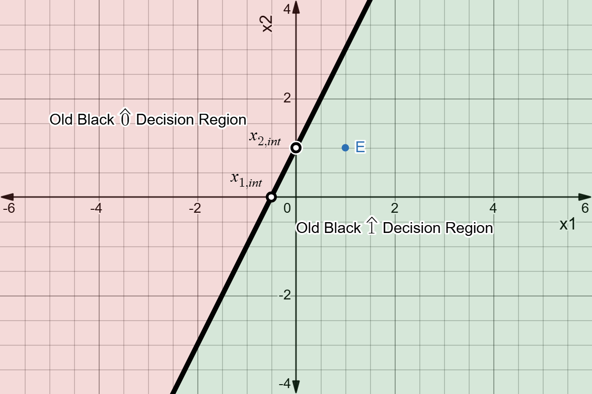
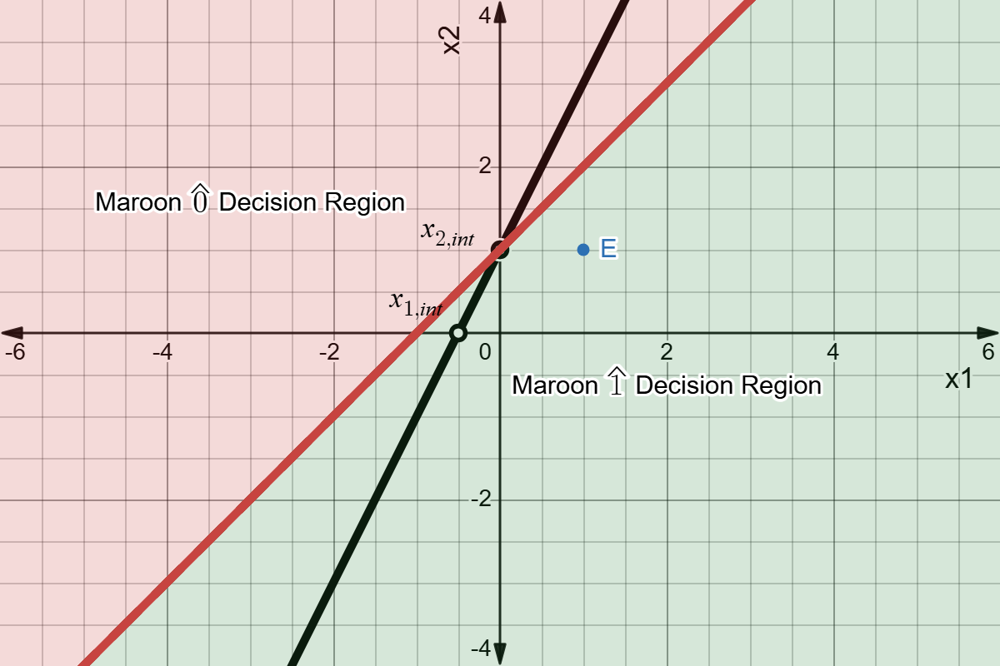
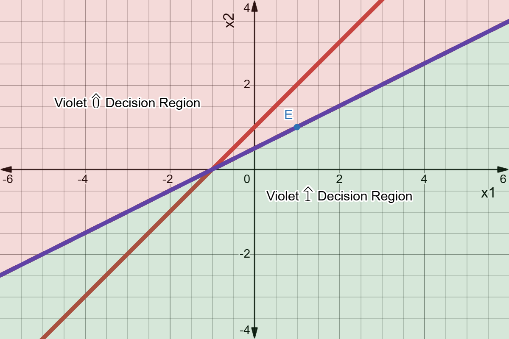
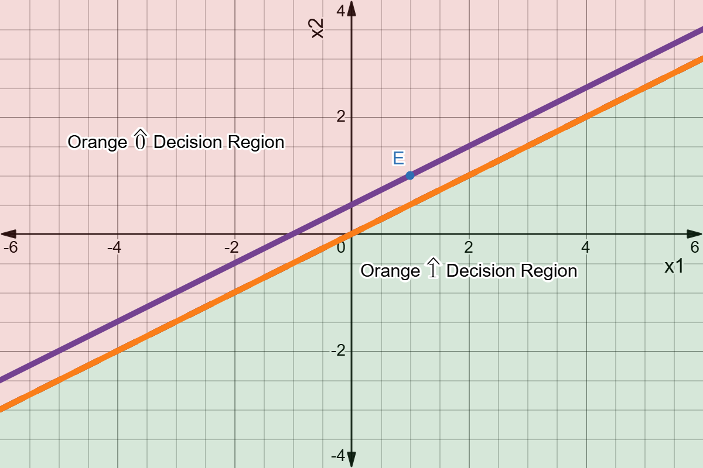

# Module 03 | Decision Boundaries and Perceptron Learning

## My Solution to [Practice Problems](module03%20Practice%20Problems.pdf)

### Table of Contents {ignore=true}


<!-- @import "[TOC]" {cmd="toc" depthFrom=3 depthTo=4 orderedList=true} -->

<!-- code_chunk_output -->

1. [Conceptual Questions](#conceptual-questions)
    1. [What is a decision boundary, and how does it relate to classification tasks?](#what-is-a-decision-boundary-and-how-does-it-relate-to-classification-tasks)
    2. [How does the bias term in a neuron affect the position of the decision boundary?](#how-does-the-bias-term-in-a-neuron-affect-the-position-of-the-decision-boundary)
    3. [Explain with an example how changing weights affects the orientation of the decision boundary.](#explain-with-an-example-how-changing-weights-affects-the-orientation-of-the-decision-boundary)
    4. [Why is it important to visualize the decision boundary when training a model?](#why-is-it-important-to-visualize-the-decision-boundary-when-training-a-model)
2. [Calculation Problems](#calculation-problems)
    1. [A perceptron has initial Weights $`w=[0.2, -0.1]`$, initial Bias $`b=0.1`$ and Learning Rate $`\eta = 0.1`$. For a training example $`x = [1, 1]`$, target is $`t=1`$ and the perceptron output is $`y=0`$. Calculate the new weights and bias after one update, using $`w_{\text{new}} \leftarrow w_{\text{old}} + \eta (t-y) x`$ and $`b_{\text{new}} \leftarrow b_{\text{old}} + \eta (t-y)`$.](#a-perceptron-has-initial-weights-w02--01-initial-bias-b01-and-learning-rate-eta--01-for-a-training-example-x--1-1-target-is-t1-and-the-perceptron-output-is-y0-calculate-the-new-weights-and-bias-after-one-update-using-w_textnew-leftarrow-w_textold--eta-t-y-x-and-b_textnew-leftarrow-b_textold--eta-t-y)

<!-- /code_chunk_output -->


### Conceptual Questions

#### What is a decision boundary, and how does it relate to classification tasks?
In the feature space of a Binary Classification Dataset, a decision boundary is a hyperplane or hypersurface — which is a straight line or a non-linear curve in 2D feature space, a plane or a non-linear surface in 3D feature space and so on — that divides the feature space into two regions.

Every classification algorithm that produces hard class labels induces decision boundaries, though not all of them explicitly model or optimize one. In Binary Classification with a single decision boundary that produces two decision regions, the model predicts that all of the data points in a region belong to one class, while all data points in the other region belongs to the other class. 

#### How does the bias term in a neuron affect the position of the decision boundary?

I will answer this question for a linear decision boundary, which is a hyperplane in n-space with the following general equation.

$$
w_1x_1+w_2x_2+\cdots \cdots \cdots + w_nx_n+b=0
$$

`b` is called the bias term.

How does this bias affect the position of the decision boundary in feature space?

Bias alone does not decide the position of the decision boundary.

`Bias and Weights`, together, decides the position of the decision boundary in feature space. So, to examine the effect of `Bias` here, I must keep `Weights` fixed.

With fixed `Weights`,
1. $`b=0 \iff`$ the decision boundary goes through the origin of the feature space.
1. if $`b \neq 0`$, the decision boundary intersects—
    * the $`x_1`$-axis at point $`\left( -\frac{b}{w_1}, 0, \cdots \cdots \cdots, 0\right)`$, with $`x_1`$-intercept of the decision boundary equal to $`-\frac{b}{w_1}`$.
    * the $`x_2`$-axis at point $`\left(0, -\frac{b}{w_2}, \cdots \cdots \cdots, 0\right)`$, with $`x_2`$-intercept of the decision boundary equal to $`-\frac{b}{w_2}`$. \
    $`\vdots`$ \
    $`\vdots`$ \
    $`\vdots`$
    * the $`x_n`$-axis at point $`\left(0, 0, \cdots \cdots \cdots, -\frac{b}{w_n}\right)`$, with $`x_n`$-intercept of the decision boundary equal to $`-\frac{b}{w_n}`$.

The larger $`\left| -\frac{b}{w_i} \right| = \left| \frac{b}{w_i} \right|`$ is, the farther, from the origin, is the point, at which the decision boundary intersects the $`x_i`$-axis.

So, with fixed `Weights`,
1. As $`\left| b \right|`$ increases, the decision boundary gets away from the origin along every $`x_i`$-feature-axis with $`w_i \neq 0`$.
1. As $`\left| b \right|`$ decreases, the decision boundary gets closer to the origin along every $`x_i`$-feature-axis with $`w_i \neq 0`$.
1. if $`w_i=0`$ for a feature $`x_i`$, the decision boundary is either `parallel` or `incident` with $`x_i`$-axis, for every possible `b`. Then,
    * $`x_i`$ has no effect in the decision.
    * the case is of `incidence` $`\iff b = 0`$.
    * the case is of `parallelism` $`\iff b \neq 0`$.
    * as $`\left| b \right|`$ increases, the decision boundary gets away from the axis.
    * as $`\left| b \right|`$ decreases, the decision boundary gets closer to the axis.
      
#### Explain with an example how changing weights affects the orientation of the decision boundary.
I will consider a scenerio based on the scenerio presented in the [Calculation Problem](#a-perceptron-has-initial-weights-w02--01-initial-bias-b01-and-learning-rate-eta--01-for-a-training-example-x--1-1-target-is-t1-and-the-perceptron-output-is-y0-calculate-the-new-weights-and-bias-after-one-update-using-w_textnew-leftarrow-w_textold--eta-t-y-x-and-b_textnew-leftarrow-b_textold--eta-t-y) below, instead of constructing a scenerio myself, with hopeful trust that my mentor has designed this scenerio with care and his longer experience.

So, my training example `E`:

```math
\begin{aligned}
E =\left( X, y\right) &= \left( \begin{bmatrix}x_1 & x_2\end{bmatrix}, y\right) \\
&= \left( \begin{bmatrix}1 & 1\end{bmatrix}, y\right)
\end{aligned}
```


Old weights and Bias of the perceptron:
```math
\begin{aligned}
\left( W, b\right) &= \left( \begin{bmatrix}w_1 & w_2\end{bmatrix}, b\right) \\
&= \left( \begin{bmatrix} 0.2 & -0.1\end{bmatrix}, 0.1\right)
\end{aligned}
```

Let's plot the old Decision Boundary on Feature Space.



Notice,
1. the decision boundary (The thick black line).
1. its decision regions labeled. For example, for points in green-shaded region, the prediction/decision is $`1`$, as denoted by $`\hat{1}`$.
1. its labeled intersection/interception points $`x_{1, \text{int}}`$ and $`x_{2, \text{int}}`$ (in black ring), with $`x_1`$-axis and $`x_2`$-axis, respectively.
1. our training example $`E`$ (in blue).

From the plot, we can see that the prediction for $`E`$, with old weights and bias is $`\hat{y} = 1 = \hat{1}`$, the `hat` over $`y`$ is to denote that this $`1`$ is a prediction. Let's verify this prediction algebraically.

$$
\begin{aligned}
\text{Weighted Sum} &= W \cdot X + b \\
&= \begin{bmatrix} 0.2 & -0.1\end{bmatrix} \cdot \begin{bmatrix}1 & 1\end{bmatrix} + 0.1 \\
&= 0.2 + (-0.1) + 0.1 \\
&= 0.2 \\
&\geq 0 \\
\\
\implies \hat{y} &=1 \\
&=\hat{1}
\end{aligned}
$$

Let's recall the `Perception Learning Rule` for a single training example.

$$
\begin{aligned}
w_{i, \text{new}} &\leftarrow w_{i, \text{old}} + \eta  (y − \hat{y}) x_i \\
\\
b_{\text{new}} &\leftarrow b_{\text{old}} + \eta  (y − \hat{y})
\end{aligned}
$$


Now, if the true class of our example $`E`$ is $`1`$, we have to update neither `Weights` nor `Bias`, thus nor our `decision boundary`.

Now, let's assume, the true class of our example $`E`$ is $`0`$. We also assume, our learning rate $`\eta`$ is $`0.1`$.

Then for our example,
```math
\begin{aligned}
\eta(y-\hat{y}) &= 0.1 (0-1) \\
&= -0.1
\end{aligned}
```

##### Updating $`w_1`$

For the 1st feature,

$$
\begin{aligned}
x_1 &= 1 \\
\\
w_{1,\text{new}} &\leftarrow w_{1,\text{old}} + \eta(y-\hat{y})x_1 \\
&= 0.2 + (-0.1) \times 1 \\
&=0.1
\end{aligned}
$$

Let's have a look at the New (Maroon) Decision Boundary with new $`w_1`$, but old $`w_2`$ and $`b`$, below.



Notice, from the Black one to the Newer Maroon one,
1. decision regions are now with respect to the newer decision boundary.
1. the decision boundary moved toward the mis-classified example. Generally speaking, the point is now closer to its true decision region.
1. $`x_{1, \text{int}}`$ is changed, because we have changed $`w_1`$ with no change in non-zero $`b`$, thus changing $`-\frac{b}{w_1}`$.
1. $`x_{2, \text{int}}`$ is unchanged, because we have changed neither $`w_2`$ nor $`b`$, thus nor $`-\frac{b}{w_2}`$.

##### Updating $`w_2`$

Now, for the 2nd feature,

$$
\begin{aligned}
x_2 &= 1 \\
\\
w_{2,\text{new}} &\leftarrow w_{2,\text{old}} + \eta(y-\hat{y})x_2 \\
&= (-0.1) + (-0.1) \times 1 \\
&=-0.2
\end{aligned}
$$

Let's have a look at the New (Violet) Decision Boundary with new $`w_1`$ and $`w_2`$, but old $`b`$, below.



Notice, from the Maroon one to the Newer Violet one,
1. as Decision Boundary changed, Decision Regions changed.
1. the decision boundary moved toward the mis-classified example. The example is now closer to its true decision region.
1. incidentally, the example is on the decision boundary, but still mis-classified.
1. $`x_{1, \text{int}}`$ is unchanged, because we have changed neither $`w_1`$ nor $`b`$, thus nor $`-\frac{b}{w_1}`$.
1. $`x_{2, \text{int}}`$ is changed, because we have changed $`w_2`$ with no change in non-zero $`b`$, thus changing $`-\frac{b}{w_2}`$.

##### Updating $`b`$

$$
\begin{aligned}
b_{\text{new}} &\leftarrow b_{\text{old}} + \eta (y-\hat{y}) \\
&= 0.1 + (-0.1) \\
&=0
\end{aligned}
$$

Let's have a look at the New (Violet) Decision Boundary with new $`w_1`$, $`w_2`$ and $`b`$, below.



Notice, from the Violet one to the Newer Orange one,
1. decision regions changed again, as it should.
1. the decision boundary moved toward a direction so that our mis-classified example `E` is closer to its true decision region. And after update of all of Weights and Bias, with respect to the Newest (Orange) Decision Boundary, our misclassified example is finally in its true decision region, as guaranted by the algorithm.
1. Both $`x_{1, \text{int}}`$ and $`x_{2, \text{int}}`$ is changed, because we have changed $`b`$ with no change in $`w_1`$ and $`w2`$, thus changing both $`-\frac{b}{w_1}`$ and $`-\frac{b}{w_2}`$.
1. the Violet Decision Boundary and the Newer Orange Decision Boundary is `parallel`. This `parallelism` is the hallmark of changing $`b`$ without changing $`w_i`$s.

###### Summary
When a perceptron updates in `Weights` and `Bias`, during training, in response to current-weights-and-bias-based misclassification of a training example,
1. it adjusts its decision boundary along every $`x_i`$-feature-axis (not for all axes at once, but one after one, though parallel computation is possible) by updating $`w_i`$, which updates the `point of intersection` or the `existence of a point of intersection` between the axis and the decision boundary.
1. then, it adjusts the decision boundary by moving it parallelly from its current position, updating either `the points of intersection` or `distance` between the decision boundary and the axes, for all axes at once.

The algorithm guarantees that the training example is in its true decision region now.

#### Why is it important to visualize the decision boundary when training a model?
Visualizing the changing Decision Boundary, while training,
1. can help understand the algorithm.
1. can be used to keep an watch if the Decision Boundary is moving in right direction, with supervision of the class of the current training example, which can help to detect any mistake in implementation code.

### Calculation Problems

#### A perceptron has initial Weights $`w=[0.2, -0.1]`$, initial Bias $`b=0.1`$ and Learning Rate $`\eta = 0.1`$. For a training example $`x = [1, 1]`$, target is $`t=1`$ and the perceptron output is $`y=0`$. Calculate the new weights and bias after one update, using $`w_{\text{new}} \leftarrow w_{\text{old}} + \eta (t-y) x`$ and $`b_{\text{new}} \leftarrow b_{\text{old}} + \eta (t-y)`$.

For this training example,
```math
\eta (t-y) = 0.1 (1-0) = 0.1
```
For the first feature,

```math
\begin{aligned}
x_1 &= 1 \\
\\
w_{1,\text{new}} &\leftarrow w_{1,\text{old}} + \eta (t-y)x_1 \\
&= 0.2 + 0.1 \times 1 \\
&=0.3
\end{aligned}
```

For the second feature,

```math
\begin{aligned}
x_2 &= 1 \\
\\
w_{2,\text{new}} &\leftarrow w_{2,\text{old}} + \eta (t-y)x_2 \\
&= (-0.1) + 0.1 \times 1 \\
&=0
\end{aligned}
```

And,
```math
\begin{aligned}
b_{\text{new}} &\leftarrow b_{\text{old}} + \eta (t-y) \\
&= 0.1 + 0.1 \\
&=0.2
\end{aligned}
```

Hence,
```math
\begin{aligned}
\text{New Weights, } w &= [0.3, 0] \\
\text{New Bias, } b &= 0.2
\end{aligned}
```

**Note:** While working on [Explain with an example how changing weights affects the orientation of the decision boundary](#explain-with-an-example-how-changing-weights-affects-the-orientation-of-the-decision-boundary) problem above, I found that the premised perceptron prediction $`y=0`$ in this problem is inconsistent with given `Weights`, `Bias` and `training example`. While solving this problem, I thought to check the consistency, but did not, because I also thought that my mentor wouldn't start posing trick questions to me so soon. The later was a wrong thought from me.